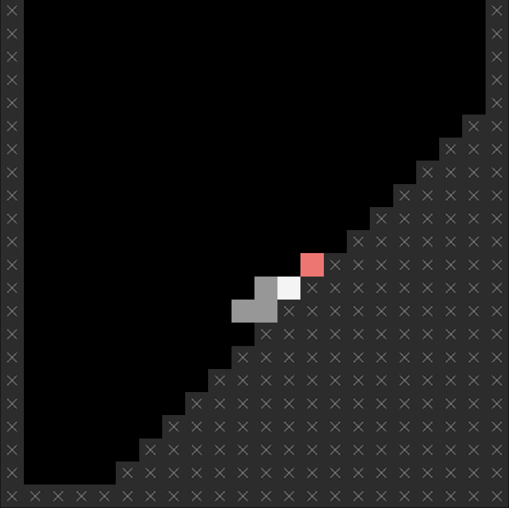

# Let's Snake: Ancient Greek Punishment

### [Play Online](../index.html)

## Dessscription

*You can do it Sssisssyphusss! Be the boulder! Keep on rollin’! Don’t ssstop! Never give up! No retreat! No sssurrender! No end in sssight! Just deliciousss Greek torment asss far asss the eye can sssee and asss fassst asss the fingersss can type or ssswipe!*

*Let's Snake: Ancient Greek Punishment* is an adaptation of my 2011 game [*Let's Play: Ancient Greek Punishment*](/lets-play-ancient-greek-punishment) into the videogame language of Snake.

*Let's Snake: Ancient Greek Punishment* was created using [Phaser 3](https://phaser.io/) along with [Hammer.js](https://hammerjs.github.io/) for touch gestures (swipes).

## Pressssss

Read the [Pressssss Kit](../press) for pressssss information

## Documentation

* Read the [Process Documentation](../process) for todos and design explorations
* Read the [Commit History](https://github.com/pippinbarr/lets-snake-ancient-greek-punishment/commits/main) for detailed, moment-to-moment insights into the development process
* Look at the [Code Repository](https://github.com/pippinbarr/lets-snake-ancient-greek-punishment) for source code etc.

## License
*Let's Snake: Ancient Greek Punishment* is licensed under a [Creative Commons Attribution-NonCommercial 3.0 Unported License](http://creativecommons.org/licenses/by-nc/3.0/).
 