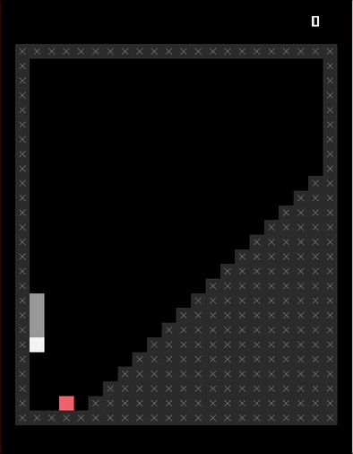
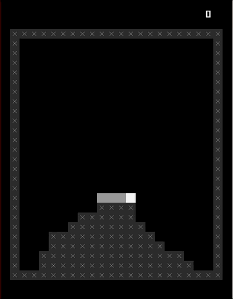
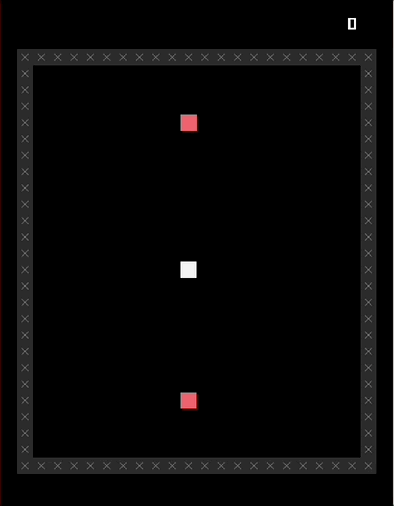
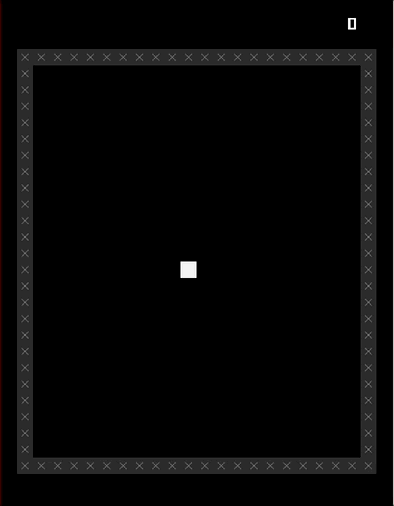
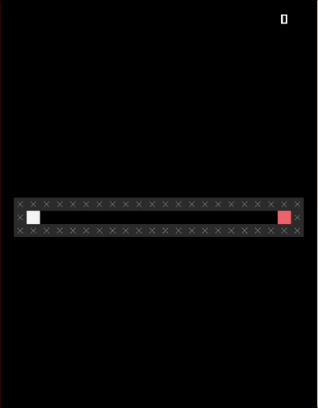

# *Let's Snake: Ancient Greek Punishment* Press Kit

### [Play Online](https://pippinbarr.com/lets-snake-ancient-greek-punishment)

## The basics

* Developer: [Pippin Barr](http://www.pippinbarr.com/)
* Release: 28 June 2024
* Platform: Browser and mobile
* Code repository: https://www.github.com/pippinbarr/lets-snake-ancient-greek-punishment/
* Price: $0.00

## Description

*You can do it Sssisssyphusss! Be the boulder! Keep on rollin’! Don’t ssstop! Never give up! No retreat! No sssurrender! No end in sssight! Just deliciousss Greek torment asss far asss the eye can sssee and asss fassst asss the fingersss can type or ssswipe!*

*Let's Snake: Ancient Greek Punishment* is an adaptation of my 2011 game [*Let's Play: Ancient Greek Punishment*](/lets-play-ancient-greek-punishment) into the videogame language of Snake.

## History

Quite frankly, I made this game as a way to make something that would largely "design itself" and also "implement itself" by leaning on a preexisting template of Snake (from *SNAKISMS*) and a preexisting set of design ideas from the *Let's Play: Ancient Greek Punishment* series. As such it was largely an exercise purely of translation/adaptation where I repeatedly asked "how would this work in the Snake world?"

And now here we are.

## Technology

*Let's Snake: Ancient Greek Punishment* was created using [Phaser 3](https://phaser.io/) along with [Hammer.js](https://hammerjs.github.io/) for touch gestures (swipes).

*Let's Snake: Ancient Greek Punishment* is an open source game licensed under a [Creative Commons Attribution-NonCommercial 3.0 Unported License](http://creativecommons.org/licenses/by-nc/3.0/).

## Features

* Snakes!
* Apples!
* Eternal torment!

## GIFs

  
*Sisyphus*

  
*Prometheus*

  
*Tantalus*

  
*Danaids*

  
*Zeno*

## Credits

* Pippin Barr: everything.

## Contact

* Email: [pippin.barr+press@gmail.com](mailto:pippin.barr+press@gmail.com)
* Website: [www.pippinbarr.com](http://www.pippinbarr.com/)
* X: [@pippinbarr](https://www.x.com/pippinbarr)
* Instagram: [@pippinbarr](https://instagram.com/pippinbarr)
* Facebook: [Pippin Barr](http://www.facebook.com/pippin.barr)

