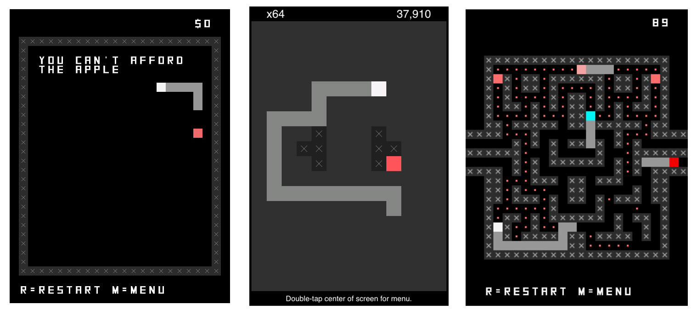
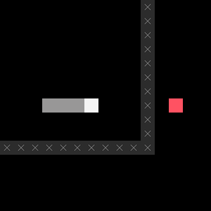
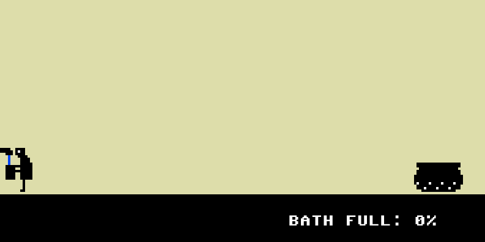
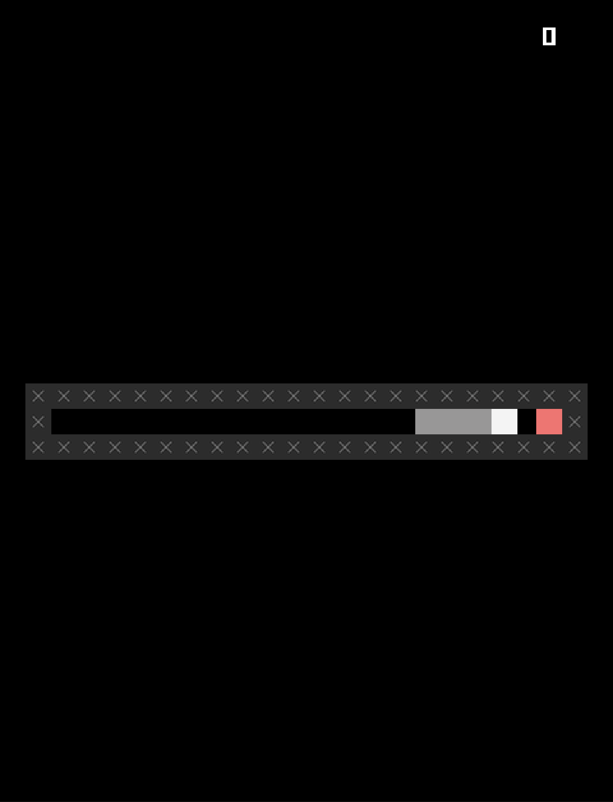

# That'sss all folksss

I'm not going to attempt to weave a beautiful narrative around this, but I *am* going to try to just draw out a few of the ideas and moments that came up during this game. Because it's such a constrained one I'm not sure there's a lot of stuff that cross-cutting, but it did raise a fair few key design ideas that have been part of my life for a long time.

## Going back to the well

Fairly recently when I was trying to come up with *incredibly simple* games I could plausibly make this summer (while also being department chair and trying to revamp my programming course) I wrote a bunch of stuff on index cards. One of the recurring themes was to return to familiar projects and formats, such as *variations* (e.g. *PONGS* etc.), *Snake* (e.g. *SNAKISMS* etc.), and also *Let's Play: Ancient Greek Punishment* (e.g. all of those things). *Let's Play: Ancient Greek Punishment*, in particular, has been a real bastion in the storms of life - I made a lot of them while Felix was small.

The point here is that design and development isn't something you can always just leap into full force, or at least not with a brand new and ambitious project. It feels like something you have to warm up. Returning to well established design ideas and conventions is also a really helpful way to make something without it needing to take over my life. And that worked out, I finished the game in *five days*:

> LIKE THE GOOD OLD FUCKING DAYS

[Journal, 27 June 2024](https://pippinbarr.com/lets-snake-ancient-greek-punishment/process/journal.html#:~:text=LIKE%20THE%20GOOD%20OLD%20FUCKING%20DAYS)

## Don't reinvent the ouroboros

> NO PIPPIN. Just use the Snake you’ve already written, that works, and move fast.

[Journal, 25 June 2024](https://pippinbarr.com/lets-snake-ancient-greek-punishment/process/journal.html#dont-reinvent-the-ouroboros--tuesday-25-june-2024:~:text=Don%E2%80%99t%20reinvent%20the%20ouroboros)

A major struggle for me, and perhaps especially because I'm currently working on my introductory programming course, is that by default I always want to engineer projects from the ground up. So my instinct was to implement Snake afresh because... well I guess I just figured it would be so clear and gleaming and beautiful as I discuss in that journal entry.

I was able to pull out of that and "only" port my Snake code from *SNAKSIMS* from Phaser 2 to Phaser 3. I could totally have just implemented *Let's Snake: Ancient Greek Punishement* in Phaser 2 and kept the whole thing, but I do think there was a little bit of value in the port because it did serve to familiarize me with the code base and it's not a *bad* thing to update to the latest big-version-number of a framework. It also only took an hour or two.

This process is part of a much larger question about design/ideas and/versus development/implementation I think. Perhaps especially for me, I find I'm very interested in the relationships between the technical underpinnings of a project and the project itself - a lot of the time I'm either explicitly trying to signal that in the resulting game (to the audience), or I'm thinking about it extensively in the process documentation. But, it's also true that that kind of thinking can "hold you back" or generate obsessions that don't always serve the project itself?

For me at least, this is a message to think more seriously about working at a slightly different "level" more often - embracing the idea of "premade" stuff, even if it was made by me earlier on. But this could extend to sort of Asset Store work or, gasp, collaborations where I don't do everything myself!

## Snake versus Myth versus The Original

> An apple to the left; an apple to the right? The left apple gives you a point and the right apple takes it away?

[Journal, 24 June 2024](https://pippinbarr.com/lets-snake-ancient-greek-punishment/process/journal.html#:~:text=Danaids,takes%20it%20away%3F)

That was my original idea for the Danaids level/minigame for this Snake version. Given the number of question marks it's obvious I wasn't sold on this, but I was just blitzing out ideas at the time. Importantly, this version of the idea is mostly an attempt to recreate the *existing game* (*Let's Play: Ancient Greek Punishment* in its standard 2D incarnations). And that's a question of what's being adapted/translated here: was this meant to be a Snake version of my previous game, or a Snake version of the same myths?

As soon as I was sitting down to work on the implementation of the above idea:

> As I started the structure for Danaids I wondered if it’s somehow a bit incorrect?

[Journal, 27 June 2024](https://pippinbarr.com/lets-snake-ancient-greek-punishment/process/journal.html#:~:text=As%20I%20started%20the%20structure%20for%20Danaids%20I%20wondered%20if%20it%E2%80%99s%20somehow%20a%20bit%20incorrect%3F)

I suppose because it *was* "incorrect," but that's such a weird thing in general. How do we know that a design approach isn't the right thing? Being able to answer that (rather than only feel it) is a huge indicator that you understand and are in tune with what the game you're making *is*. Part of design is building up that sense (I suppose it's like taste) and part of accountable design-research is being able to actually explain that sense.

So, yeah this case it was about the relationship between the game I was working on and its *two* referents. I had essentially defaulted to thinking I was adapting/porting the previous *game* (*Let's Play: Ancient Greek Punishment*), but really my design-heart knew that I should have been thinking more about adapting the original myths. 

In going with that sense of incorrectness I was able to rethink the Danaidsss in terms of the original myth, which is about gathering something (water) only to have it slip away (sieve). And that framing allows you to actually connect up the elements to the mechanics/affordances of Snake as a world:

> - "The snake is the bathtub"
> - "The apple is the water"
> - "You 'drink' (eat) the 'water' (apple) to gain points"
> - "But the points drain away"

[Journal, 27 June 2024](https://pippinbarr.com/lets-snake-ancient-greek-punishment/process/journal.html#:~:text=A%20simpler%20version,the%20original%20game%E2%80%A6)

This is a much better representation of the myth. In fact, as I noted in the journal, I think it's actually better than what I made in the original game. And this is also really about the heart of this kind of adaptation-oriented project for me: it's about seeing and elaborating the potential connections between the mechanics and imagery and elements of the target system (Snake in this case) with the source system (shifted from the previous *game* to the original *myths* in this case).

## Comic timing and Math

There was at least *one* key moment of implementation-level design thinking, and it showed up with Zeno, which I think was the most difficult to think through in the context of Snake.

When it came time to grapple with Zeno specifically I struggled again to immediately see how that myth could make sense in the specific setup of a Snake world. I identified a couple of problems quickly:

- The issue of the world being in 2D made it harder to think in terms of a set, linear destination
- Just reusing the solution from the original game (essentially a kind of repeated zooming in) felt wrong given that Snake doesn't traditionally involve any camera movements

In a way, these reflections are examples of *prioritizing the target system* when it comes to making design decisions. That is, if there's a conflict between how the target system works (at least conventionally) and what the source system "wants," you should try to resolve in favour of the target system. I'm not sure why I feel that way about it, and it's very likely that interesting design possibilities would come out of reversing this! I think for me there's an attraction to holding the target system relatively set because it creates a bunch of constraints that a) make design a bit easier and b) kind of surface your design thinking more clearly.

I eventually "zoomed in" on the idea of *time* being used to represent the paradox rather than space: it takes progressively longer and longer to move "half-way" to the destination. I started out with the idea that the tick time would double each time you reached half-way, and found this especially funny because it would mean that Zeno would *actually reach the apple*:

> I mean one funny thing with Zeno in Snake’s world, actually (and in all game worlds potentially) is that the world is quantized or whatever… there’s a very specific measure of moving one unit and it takes a very specific amount of time… there’s no such thing as moving halfway between two tiles on a Snake board...

[Journal, 27 June 2024](https://pippinbarr.com/lets-snake-ancient-greek-punishment/process/journal.html#:~:text=I%20mean%20one,a%20Snake%20board%E2%80%A6)

This relationship between representations of time as kind of conintuous and infinitely divisible versus tick-based time in Snake was one of the more fun realizations that came out of this project. When I actually started working on it though:

> I start converting it so the tick time would double every time you got "half-way" to the apple, but that won't make a very good point because in that case you'll get there in not much time

[Commit 0f6c993](https://github.com/pippinbarr/lets-snake-ancient-greek-punishment/commit/0f6c99318556f288f42265ce2542b153ce66fdd9)

Which is to say it was *kind of* a fair representation of the paradox, but in ending so quickly it losing the comedy you could get out of seeing the snake inch its way to the apple... and then actually eat it! That last moment, where it finally crests the final tile and you hear the sound, that would actually be really funny. But it needed to be significantly delayed and I couldn't think of a reasonable way to do it.

Instead, I went with the idea of halving the snake's move-distance each time it reached a half-way point. It slows down more and more and more. This works visually because you get that sense of an expansion of time which is sort of what Zeno's paradox does to you.

But then a weird thing happened: Zeno eventually just... stopped! Because of some math stuff:

> And for SOME REASON I don't 100% get but is doubtless to do with float accuracy in JS the snake effectively stops right in front of the apple, never getting there... I think there's a point of preceision where you are trying to add the grid size but it's so small it gets rounded away when added to the position... which might be something about a difference between the "normal" float representation (0.327472389423 etc.) and the e representation (1.2e3247237894 etc.)?

[Commit 3dcf8d4s](https://github.com/pippinbarr/lets-snake-ancient-greek-punishment/commit/3dcf8d4a3b281f5aebf1233a7d21c6f5d93f2f1b)

Which was... perfect. Fuck you, Zeno.