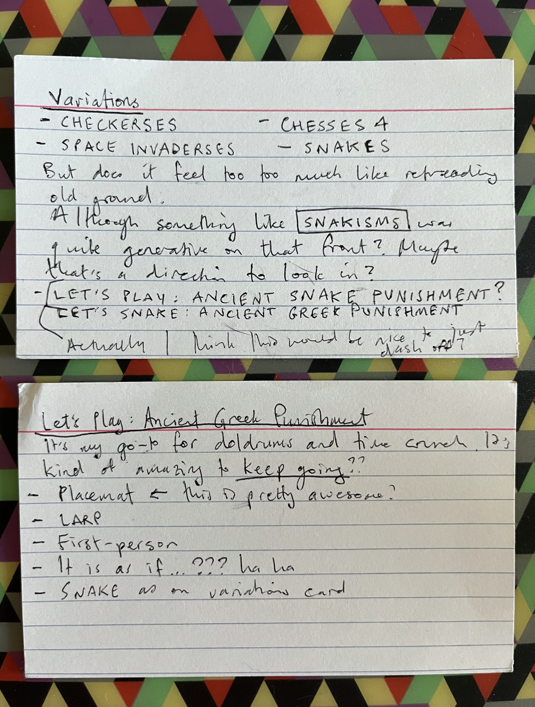

# Journal

## Revisionist history -- ?? June 2024

I'm swooping in to add a precursor image of the index cards I wrote in June as I tried to come up with ideas for a game to make:

## Start-up Culture -- Monday 24 June 2024

Well I started something. I figured (as per the [Why](./why.md)) I should just make something that should be "easy". I really hope it doesn't end up being, you know, not-easy.

But in principle I just need to implement snake, which I've done before, and then design snake levels and mechanical tweaks that turn it into the five punishment myths I always do.

First pass:

### Sisyphus

A stair (hill) of walls; apple at the bottom; each time you eat it the next one is up a step; at the top it resets to the bottom; 

Questions: 
- what about points? A global no points? Or you can get points? Do I care about the drama of reaching the infinite points? I do not. I kind of like the idea of points because it validates Sisyphus for carrying on. There is a reason. Punished but progressing.

### Prometheus

A rock of walls (in the form of the previous games); snake is laid across the top; ... and then?

Questions:
- how to represent a struggle? you can push a key that raises your snake head but it just falls back?
- how to represent the eagle? a wall that flies down from the sky and hits and kills you (instantly since there's no incremental death); is it scare away by the struggle? I suppose so? Might end up seeming a bit awkward...

### Tantalus

An apple above you, an apple below you; when you approach either it zips up and off the screen or behind a wall to become unattainable; returns once you're out of range; (this could be fiddly)

### Danaids

An apple to the left; an apple to the right? The left apple gives you a point and the right apple takes it away?

### Zeno

Maybe the effect is on time instead of distance? Is that fair? Like at the half-ways you take exponentially longer?

Or the tile increment gets smaller and smaller until there's no motion?

How to handle the two-dimensionality?

## Don't reinvent the ouroboros -- Tuesday 25 June 2024

I caught myself thinking about how I would engineer a new version of Snake for Let's Snake and it would be so clean and beautiful and also arguing that the previous version was written in Phaser 2 etc.

But NO PIPPIN. Just use the Snake you've already written, that works, and move fast. In honour of that I'm going to do it now BEFORE I do anything else today. Let's see if I can do the conversion to Phaser 3 quickly... or is it a hell waiting in there for me? LET'S SEE.

This is a bigger picture thing about game making too. And maybe especially for how I'm feeling about it just lately? I've spent a lot of time quite embedded in the specifics of implementations and surfacing them... and that has led to dwelling a lot on technical matters, luxuriating even... which takes time. And is interesting, but it's a timeline I don't think I want right now. I'd like to go idea->thing a little faster.

So, less love of code and more love of game.

## Sisyphusssed -- Wednesday 26 June 2024

Well I guess I got Snake working yesterday and then also got the Sisyphus level pretty tidied away? It came together pretty easily because of... the constraints! Yay constraints! Things fall into place in this kind of hybridization and adaptation, fewer choices.

I suspect Sisyphus was the easiest but that's alright, I'll pop away the others over the next days. As it comes so it goes.

Feels good to be making something that makes sense. 

## Danaidssssss? -- Thursday 27 June 2024

As of this morning we now have

- Sisyphus
- Prometheus
- Tantalus

in the can. As I started the structure for Danaids I wondered if it's somehow a bit incorrect?

So the point/idea in Danaids is you're trying to carry something from one place to another but it runs away before you get there.

In the game version I did a different version, which was that you get there but the receptacle itself drains away the water.

In terms of Snake it's a bit tricky. There are some "obvious" ideas:

- The thing you carry probably has to be an apple since you pick it up
- The representation of that apple draining away probably has to be your points going down (maybe one by one)

But how do you indicate the idea of *taking the apple* to a place. The Snake only consumes, it doesn't transport...

The initial thought was to use another apple that represents the destination... so the first apple appears, you eat it and get points, the other apple appears, you eat it and lose the points...

That recreates the to and fro and the idea of loss. Arguably the behaviour of the second apple makes very little sense though... inconsistent.

A simpler version would be to say

- "The snake is the bathtub"
- "The apple is the water"
- You eat the water to gain points
- But the points drain away

You know, that's better I think... no need to be wedded to the visual dynamics of the original game...

So you eat an apple and before the next one shows up your points have drained away. Love. Probably want a sound effect?

## Zeno? --- Thursday 27 Jube 2024

If I could conquer the Zeno concept I could probably have this game finished today which would mean I'd made it in four days which is LIKE THE GOOD OLD FUCKING DAYS.

As per my initial thought, how do you handle it being 2D? The point of Zeno is you're trying to go SOMEWHERE - there's a point of reference - and if the player can direct the snake away from that somewhere it doesn't work...

In the original game you can only apply effort to moving forward toward the flag (should I have a flag?).

So in the Snake it wouldn't be totally unreasonable to have the snake "on the ground" and only able to move right...

I could *literally* recreate the original with a repeated "half-way and slide-back" but it sort of seems wrong?

You could do the thing of progressively zooming in to show the (lack of) progress. Eventually you'd just see an edge of the snake moving one pixel... but nothing about the game so far has involved the idea of a camera that can be manipulated...

You could also switch over to time and double the number of tickets required to get halfway? With an Infinite number of tickets when you're right there to cheat... I mean one funny thing with Zeno in Snake's world, actually (and in all game worlds potentially) is that the world is quantized or whatever... there's a very specific measure of moving one unit and it takes a very specific amount of time... there's *no such thing* as moving halfway between two tiles on a Snake board...

... so does that open up the idea of actually getting the apple? Is that funnier than not? Let me try it out at least.

